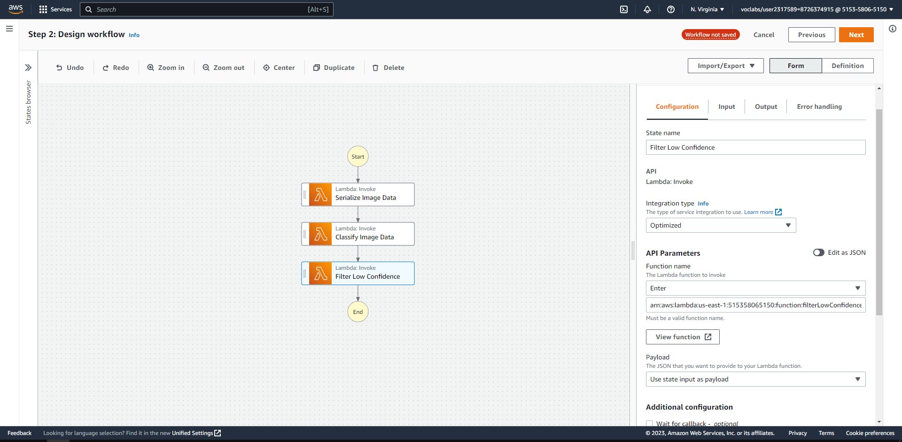
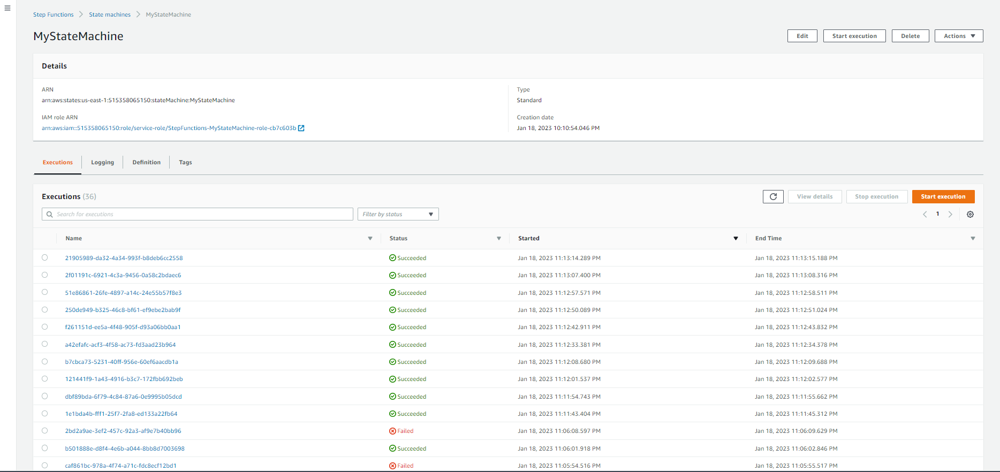

# Build a ML Workflow For Scones Unlimited On Amazon SageMaker

## AWS Machine Learning Engineer Nanodegree

## Overview

Image Classifiers are used in the field of computer vision to identify the content of an image and it is used across a broad variety of industries, from advanced technologies like autonomous vehicles and augmented reality, to eCommerce platforms, and even in diagnostic medicine.

In this project, you’ll use AWS Sagemaker to build an image classification model that can tell bicycles apart from motorcycles. You'll deploy your model, use AWS Lambda functions to build supporting services, and AWS Step Functions to compose your model and services into an event-driven application. At the end of this project, we will have created a portfolio-ready demo that showcases the ability to build and compose scalable, ML-enabled, AWS applications.

## Project Steps Overview
- Step 1: Data staging
- Step 2: Model training and deployment
- Step 3: Lambdas and step function workflow
- Step 4: Testing and evaluation
- Step 5: Optional challenge
- Step 6: Cleanup cloud resources

## Workspace Instructions

* For this project, you will complete the work within the AWS lab provided through the Udacity classroom.
* Proceed with the project within the [jupyter notebook](Build_a_ML_Workflow_For_Scones_Unlimited_Notebook.ipynb).

## Project Environment

### Sagemaker Studio
You should already have the Sagemaker Studio User created from earlier in the course, so you'll just need to launch the studio.

In case you need a refresher:

- Proceed to open up the AWS console from the AWS Gateway.
- Click through the AWS console to Amazon Sagemaker.
- Click through the main Sagemaker page to Amazon Sagemaker Studio from the left hand toolbar.
- If a user does not exist already in the Sagemaker Studio Control Panel, Add user.
- Select an execution role that has full Sagemaker Access, otherwise you can create a new role.
- Create a role and proceed with creating the user.

### Lambda Functions
You need the Lambda service to complete the project. At this point, you should have already created and deployed a few lambda functions at this point.

In case you want to test it again:

- Proceed to open up the AWS console from the AWS Gateway.
- Click through the AWS console to Amazon Lambda.
- Click to create a lambda function.
- Test the lambda function is working

### Step Function Visual Editor
You should have access to the step function visual editor. If you want to double-check:

- Proceed to open up the AWS console from the AWS Gateway.
- Click through the AWS console to Step Function.
- Click to create a state machine.
- Choose to design your workflow visually
- Create a simple Step function

## Dependencies
This notebook has been tested on the **Python 3 (Data Science)** kernel with the **ml.t3.medium** instance.

## Results:

### Lambda Functions:

1. The [Serialize Image Data Lambda Function](lambda_functions/serializeImageData.py): 
takes the address of an image hosted in S3, then serializes and returns a JSON object.

2. The [Classify Image Data Function](lambda_functions/classifyImageData.py):
takes the JSON object returned from the **Serialize Image Data Lambda Function** and passes it to an end point and return the inference result.

3. The [Filter Low Confidence Function](lambda_functions/filterLowConfidence.py) takes the result from inference data from the **Classify Image Data Function** and return the images that surpass the threshold.  

### Step Function Summary

### Step Function Working

